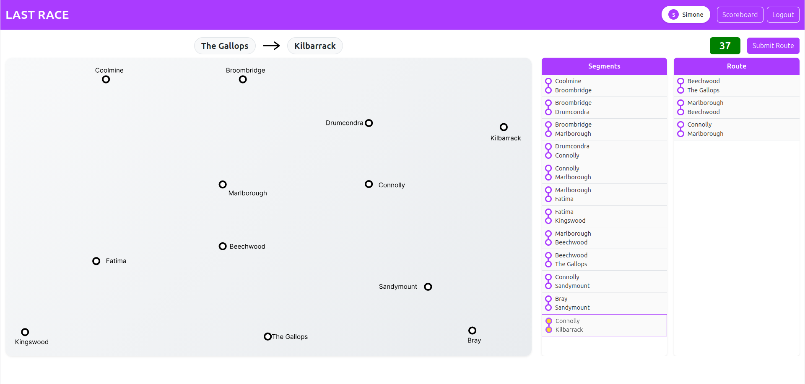
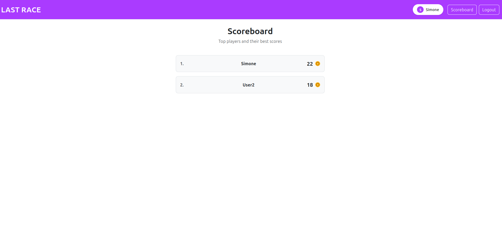

# Exam #1: "Last Race"

## Student: s354464 SALERNO SIMONE

## React Client Application Routes

- Route `/`: public landing page with game instructions and a login button.
- Route `/login`: login form with username and password fields.
- Route `/game`: main game page (authenticated only), managing four phases — Setup, Planning, Execution, and Result.
- Route `/scoreboard`: scoreboard page (authenticated only) displaying ranked users and their best scores.

## API Server

- **POST `/api/sessions`**
  - request body:  
   `{ username: string, password: string }`
  - response:  
    `{ id: number, username: string }`on success;  
    `401` with `{ error: { message } }` on bad credentials;  
    `400` on invalid fields.

- **GET `/api/sessions/current`**
  - no request body
  - response:  
  `{ id: number, username: string }` if logged in;  
  `401` with `{ error: "Not authenticated" }` otherwise.

- **DELETE `/api/sessions/current`**
  - no request body
  - response: empty body (200). Logs out the current session.

- **POST `/api/game/start`**
  - authentication required
  - no request body
  - response:  
  `{ start: string, destination: string }` — random pair of stations at least 3 segments apart.

- **POST `/api/game/submit`**
  - authentication required
  - request body:  
  `{ route: [[station1Id, station2Id], ...] }`
  - response: 
    ```js 
    { 
      valid: true, 
      events: [{ 
        station1, 
        station2, 
        event: { 
          description, 
          effect 
        } 
      }, ...], 
      finalScore: number }
    ``` 
    on success;  
    `{ valid: false, error: string }` on invalid route.

- **GET `/api/segments`**
  - authentication required
  - no request body
  - response:  
  array of `{ station1Id, station2Id, station1Name, station2Name }` (all metro segments).

- **GET `/api/scoreboard`**
  - authentication required
  - no request body
  - response:  
  array of `{ username: string, bestScore: number }` sorted by bestScore descending.

- **GET `/api/metro-map.svg`**
  - authentication required
  - no request body
  - response: the metro network SVG file content.

## Database Tables

- **`stations`** — individual metro stations (columns: `stationId`, `name`).
- **`lines`** — metro lines (columns: `lineId`, `name`).
- **`segments`** — undirected connections between two stations (columns: `station1Id`, `station2Id`, with `station1Id < station2Id` constraint).
- **`line_stations`** — junction table mapping which stations belong to which lines (columns: `lineId`, `stationId`).
- **`users`** — registered users with password hashes, salt, and best score (columns: `userId`, `username`, `password_hash`, `salt`, `bestScore`).
- **`events`** — random events that occur during route execution, each with a point effect between -4 and +4 (columns: `eventId`, `description`, `effect`).

## Main React Components

- **`Header`** (`components/Header.jsx`): navigation bar with app title, user avatar, Scoreboard and logout buttons.
- **`PublicPage`** (`components/PageLayout.jsx`): landing page showing game instructions and a login button.
- **`GamePage`** (`components/PageLayout.jsx`): orchestrates the game state machine (Setup → Planning → Execution → Result).
- **`ScoreboardPage`** (`components/PageLayout.jsx`): fetches and renders the ranked scoreboard.
- **`LoginForm`** (`components/Auth.jsx`): username/password form.
- **`SetupPhase`** (`components/Phases.jsx`): displays the full metro map, and triggers game start.
- **`PlanningPhase`** (`components/Phases.jsx`): displays the map with only the stations, allows to pick segments and build a route, over the 90 seconds countdown.
- **`ExecutionPhase`** (`components/Phases.jsx`): steps through route segments showing random event cards.
- **`ResultPhase`** (`components/Phases.jsx`): shows final score and "Play Again" button.
- **`Segment`** / **`SegmentHorizontal`** / **`MetroMap`** (`components/Metro.jsx`): visual components for displaying metro segments and the full SVG map.


## Screenshots

### During Game


### Scoreboard


## Users Credentials

| Username | Password    |
|----------|-------------|
| Simone   | password    |
| User2    | password2   |
| User3    | password3   |

## Use of AI Tools
Briefly describe whether you used any AI tools (e.g., ChatGPT, GitHub Copilot, Claude) while working on this project, for which purposes (e.g., clarifying concepts, debugging, generating code), and how you verified or adapted their output.
If you did not use any AI tools, simply state so.

- Github Copilot inline suggestions: it helped me to speed up coding. I used it only when it was suggesting exactly what I was already thinking to write, since it often suggest random code that can lead to errors.
- Claude online chat: I used it to help me fix the CSS and to help me import the SVG map without treating it as an image. Since it does not have access to the project, its output was very generic, so I had to adapt it to integrate it in the codebase.
